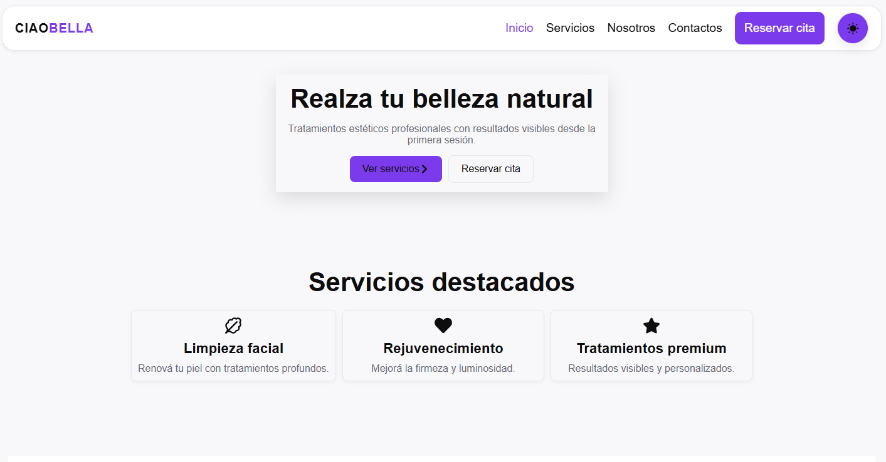

# CiaoBella Wed

Proyecto realizado para la estetica Ciao Bella

# Caracteristicas principales

1.  Visualización de servicios estéticos disponibles.
2.  Interfaz moderna y responsiva.
3.  Reserva de turnos online.
4.  Formularios validados.
5.  Integración de mapas para ubicación.
6.  Indicadores de carga para mejorar la experiencia de usuario.
7.  Navegación dinámica entre secciones.

# Ver online

Puedes ver el proyecto online puede ingresar al link: (https://ciao-web-tau.vercel.app)

### Instalacion

1.  Clonar el repositorio.
2.  Entrar a la carpeta del proyecto `cd ciao`.
3.  Ejecutar el comando `npm install` para instalar las depedencias y crear la carpeta `node_modules`.
4.  Ejecute el comando `npm run dev` para levantar la app en un entorno local.

# Requisito

> Es necesario contar con la version de Node v24.14.0

Puedes verificar tu version con:

> node -v

### Librerías instaladas

- **react-datepicker**  
  Selector de fechas para la reserva de turnos.  
  https://www.npmjs.com/package/react-datepicker

- **react-day-picker**  
  Calendario flexible para selección y gestión de días disponibles.  
  https://daypicker.dev/

- **react-dom**  
  Permite renderizar los componentes React en el DOM del navegador.  
  https://react.dev/

- **react-hook-form**  
  Manejo y validación de formularios de forma eficiente.  
  https://react-hook-form.com/

- **react-icons**  
  Biblioteca de íconos para React.  
  https://react-icons.github.io/react-icons/

- **react-leaflet**  
  Integración de mapas interactivos con Leaflet en React.  
  https://react-leaflet.js.org/

- **react-router-dom**  
  Manejo de rutas y navegación entre páginas en React.  
  https://reactrouter.com/

- **react-spinners**  
  Indicadores de carga y spinners para mejorar la experiencia de usuario.  
  https://www.davidhu.io/react-spinners/

# Objetivo del proyecto

El objetivo principal fue desarrollar una plataforma web para la estética Ciao Bella, ofreciendo una presencia digital profesional y facilitando la interacción de los clientes con los servicios y reservas del negocio.

# Autor

Desarrolado por Jose Vitriago.
